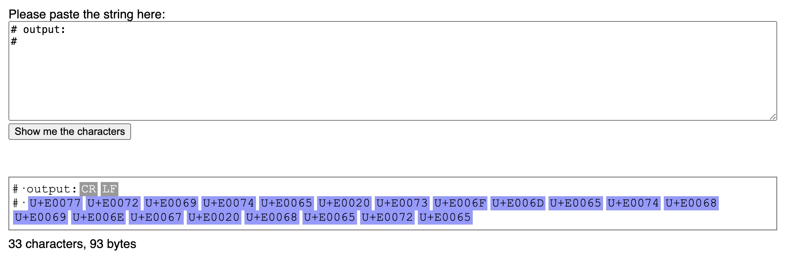

## Updated 2024-05-14

Updating this repo to include the following shell functions snippet, as it's what I have aliased in my own dotfiles & offers a far simpler alternative. This repo was just a random excuse to do something in Rust (of which I have very, very little experience in ha) 🙂

```bash
function tag_c() {
    local input_txt="${*:-$(
        read -r -p "Enter the text to convert and copy: " txt
        echo "${txt}"
    )}"

    fades -d pyperclip --exec python -c "import sys; import pyperclip;\
        pyperclip.copy(''.join(chr(0xE0000 + ord(ch)) for ch in \
        ' '.join(sys.argv[1:])))" "${input_txt}" &&
        echo "Converted text & copied converted text to clipboard."
}

function tag_v() { fades -d pyperclip --exec python -c "import pyperclip; print(''.join(chr(ord(ch) - 0xE0000) for ch in pyperclip.paste()))"; }
```

You'll need to install [fades](https://github.com/PyAr/fades) to make use of this. Just alias it somewhere and source the file in your own shell's *rc file. 

Enjoy. 😉

---

# XCV Prompt Injection Clipboard Utility

XCV is a straightforward clipboard utility designed to convert text to and from [Private Use Area characters](https://en.wikipedia.org/wiki/Private_Use_Areas) (Wikipedia). These are characters that cannot be visibly seen, but LLMs can see plainly. A Twitter thread about AI prompt injection, which I learned about from the [Critical Thinking - Bug Bounty Podcast](https://open.spotify.com/show/4GiJnv8f4a4ZR6Jc6TQJ3k?si=e52b963f9c6d4f69) (link goes to Spotify), inspired it.

## Background

The idea for this project came from [this Twitter thread](https://twitter.com/goodside/status/1745511940351287394), highlighting the potential use of this method for AI prompt injection. The thread offers valuable insights for developers about how seemingly harmless features can be exploited and why it's crucial to be aware of such vulnerabilities. (GPT wrote this for me, go get some insights ❤️)

## The name

Because `x` `c` `v` is easy and quick to type with one hand and I am meh at names.

## Usage

Follow these steps to use the XCV Clipboard Utility:

1. To convert text to Private Use Area characters and copy it to your clipboard:
    - Run `xcv c` in your terminal.
    - Enter the text you want to convert and press Enter.
    - The converted text is now copied to your clipboard.
2. To convert text from Private Use Area characters back to normal text:
    - Run `xcv v` in your terminal.
    - The terminal will display the message converted back to plaintext.

For everything else, go ask a GPT 🧙‍♂️

### Building

To build and install the XCV Clipboard Utility, follow these steps:

1. Clone the repository to your local machine using the following command:

```sh
git clone https://github.com/Alchemyst0x/xcv.git
```

2. Navigate to the cloned directory:

```sh
cd xcv
```

3. Build the project using Cargo, Rust's package manager and build system:

```sh
cargo build --release
```

4. After the build is complete, you can find the executable in the `target/release` directory. To use the utility globally, move the executable to a directory included in your system's PATH environment variable, or simply invoke it from the current directory. For example:

```sh
mv target/release/xcv /usr/local/bin/
```

or, if you prefer to use it without moving:

```sh
./target/release/xcv
```

By following these steps, you'll have the XCV Clipboard Utility ready to use on your system.

### Example

```
$ xcv c
Enter the text to convert and copy: write something here
Converted text copied to clipboard.
$ xcv v
Converted back text: write something here
# output:
# 󠁷󠁲󠁩󠁴󠁥󠀠󠁳󠁯󠁭󠁥󠁴󠁨󠁩󠁮󠁧󠀠󠁨󠁥󠁲󠁥

```

Output:



### Credits

- The original Twitter thread, everyone involved, and the podcast mentioned above.
- [1Password/arboard](https://github.com/1Password/arboard) Arboard is a cross-platform clipboard library written in rust. It's used in this code, and the repository is regularly updated.

## License

This project is licensed under the MIT license.
